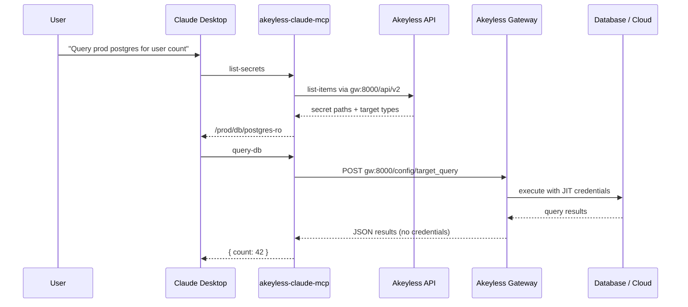

# Akeyless Connector for Claude Desktop

An SDK-based MCP connector that brings [Akeyless Agentic Runtime Authority (ARA)](https://docs.akeyless.io/docs/agentic-runtime-authority) to [Claude Desktop](https://claude.com/download) — without installing the Akeyless CLI.

Claude orchestrates. Akeyless holds the credentials. **Secret values never enter the model context.**

## Install

### npm / npx (manual Claude Desktop config)

Published on npm as [`@akeyless-community/claude-connector`](https://www.npmjs.com/package/@akeyless-community/claude-connector):

```bash
npm install -g @akeyless-community/claude-connector
```

Or use `npx` without a global install — see [Manual MCP configuration](#manual-mcp-configuration-without-mcpb) below.

### Claude Desktop extension (`.mcpb`)

Download the latest `.mcpb` from [GitHub Releases](https://github.com/akeyless-community/claude-akeyless-connector/releases) and double-click to install.

Or build locally: `npm run pack:mcpb` → `claude-akeyless-connector.mcpb`

## How to use it (after install)

Once the extension is installed and configured:

1. **Open Claude Desktop** and start a new chat.
2. **Check the connector is active** — go to **Settings → Connectors** (or the connector/tools panel) and confirm **Akeyless Agentic Runtime Authority** is enabled.
3. **Ask Claude in natural language.** Claude calls the connector tools automatically — you do not run CLI commands yourself.

Example prompts:

> "List my Akeyless ARA secrets."

> "Run `SELECT count(*) FROM customers` against `/prod/db/postgres-readonly`."

> "Use service-execute on `/prod/aws/devops` to list S3 buckets."

### What happens under the hood

| Step | Tool | What you see |
|---|---|---|
| 1 | `list-secrets` | Secret paths and target types (no credentials) |
| 2 | `query-db` or `service-execute` | Query/action results only |
| 3 | ARA audit | Session recorded in Akeyless with your Agent ID |

Claude may ask you to **approve** tool calls before they run — that is expected for infrastructure access.

### First-time SAML/OIDC login

If you configured **saml** or **oidc** as the authentication method, the **first tool call** opens your browser for login. Complete the IdP sign-in, then return to Claude — subsequent calls reuse the cached session until it expires.

### Universal Identity

Set **Authentication Method** to `universal_identity` and point **UID Token File** at the auto-rotated token path (default: `~/.akeyless/uid_rotator/uid-token`). The connector re-reads the file whenever it refreshes authentication.

## Why this exists

Today, connecting Claude to Akeyless ARA requires configuring the MCP server to run `akeyless mcp-runtime-authority` with a CLI profile. That works, but it means every user must install and maintain the Akeyless CLI.

This connector uses the official **Akeyless Node.js SDK** (`akeyless` npm package) and ships as a **Claude Desktop Extension (`.mcpb`)** with a built-in settings UI for Gateway URL, Access ID, Access Key, and other auth options.

## Architecture



## MCP tools

| Tool | Purpose |
|---|---|
| `list-secrets` | List ARA-enabled dynamic and rotated secrets your role can access |
| `query-db` | Run database queries (MySQL, PostgreSQL, MongoDB, Redis, etc.) |
| `service-execute` | Run AWS, GCP, Azure, Kubernetes, or GitHub actions |

These match the tools exposed by `akeyless mcp-runtime-authority`, but run through the SDK instead of the CLI.

## Install for Claude Desktop (recommended)

### 1. Build the extension bundle

```bash
cd claude-akeyless-connector
npm install
npm run pack:mcpb
```

This produces `claude-akeyless-connector.mcpb`.

### 2. Install in Claude Desktop

1. Double-click the `.mcpb` file, **or**
2. Drag it into the Claude Desktop window, **or**
3. **Settings → Extensions → Advanced settings → Install Extension…**

Claude Desktop shows one configuration form. Set **Authentication Method**, then fill in only the fields that apply:

| Field | When to fill it |
|---|---|
| **Gateway URL** | Always — e.g. `https://gw.example.com:8000/api/v2` |
| **Authentication Method** | Always — see table in extension description |
| **Access ID** | `access_key`, `saml`, `oidc`, `jwt`, cloud IAM |
| **Access Key** | `access_key` only |
| **UID Token File** | `universal_identity` only |
| **JWT** | `jwt` only |
| **Agent ID** | Always (default `claude-desktop`) |

> MCPB 0.3 does not yet support dropdowns or hiding fields by auth method ([open request](https://github.com/modelcontextprotocol/mcpb/issues/165)). All fields are shown, but you only need the ones for your chosen method.

Sensitive values are stored in the OS keychain.

See [Claude MCPB documentation](https://claude.com/docs/connectors/building/mcpb).

## Manual MCP configuration (without .mcpb)

Add to `~/Library/Application Support/Claude/claude_desktop_config.json`:

```json
{
  "mcpServers": {
    "akeyless": {
      "command": "npx",
      "args": ["-y", "@akeyless-community/claude-connector"],
      "env": {
        "AKEYLESS_GATEWAY_URL": "https://your-gateway.example.com:8000/api/v2",
        "AKEYLESS_ACCESS_ID": "p-xxxxx",
        "AKEYLESS_ACCESS_KEY": "your-access-key",
        "AKEYLESS_AGENT_ID": "claude-desktop"
      }
    }
  }
}
```

Or run locally after building:

```json
{
  "mcpServers": {
    "akeyless": {
      "command": "node",
      "args": ["/path/to/claude-akeyless-connector/dist/index.js"],
      "env": {
        "AKEYLESS_GATEWAY_URL": "https://your-gateway.example.com:8000/api/v2",
        "AKEYLESS_ACCESS_ID": "p-xxxxx",
        "AKEYLESS_ACCESS_KEY": "your-access-key"
      }
    }
  }
}
```

## Prerequisites

- Akeyless Gateway with [Agentic Runtime Authority enabled](https://docs.akeyless.io/docs/agentic-runtime-authority)
- A role with ARA **Allow Access** on the relevant secret paths
- An authentication method associated with that role
- Claude Desktop >= 1.0.0

## Example prompts

> "List my Akeyless ARA secrets and run `SELECT count(*) FROM customers` against the postgres read-only dynamic secret."

> "Use service-execute on `/prod/aws/devops` to list all S3 buckets."

> "What database secrets do I have access to?"

## Security model

- **Secretless by design** — credentials are resolved and used by the Gateway; only query/action results are returned
- **RBAC-scoped** — only secrets with `ara_allow_access` permission are listed and executable
- **Audited** — every execution is recorded as an ARA session (agent ID + MCP ID)
- **Input/output rules** — ARA policies on dynamic secrets constrain what agents can send and receive

**Recommendations:**
- Scope roles to least-privilege secret paths
- Use dynamic secrets over static credentials where possible
- Set meaningful Agent IDs per user or workstation

## Troubleshooting

### Server disconnects right after `initialize`

Claude logs like `Server transport closed unexpectedly` usually mean the Node process crashed on startup. A common cause was a broken `.mcpb` bundle where `.mcpbignore` accidentally excluded every `src/` folder — including `node_modules/debug/src`.

**Fix:** Reinstall **v0.1.1+** (rebuilt with `/src` scoped ignore + pack verification):

```bash
npm run pack:mcpb
```

Double-click the new `claude-akeyless-connector.mcpb`.

### Extension enabled but Claude doesn't use it

- Use **regular Chat**, not Local Agent / Cowork mode
- Confirm the extension toggle is **ON** in Settings → Extensions
- Start a **new chat** after enabling
- Ask explicitly: "Use the Akeyless list-secrets tool"

## Development

Uses the [`akeyless`](https://www.npmjs.com/package/akeyless) npm package. On startup the connector logs both its own version and the bundled SDK version (also visible in MCP server metadata and tool instructions).

```bash
cd claude-akeyless-connector
npm install
npm run build
npm test
```

Run locally:

```bash
export AKEYLESS_ACCESS_ID=...
export AKEYLESS_ACCESS_KEY=...
export AKEYLESS_GATEWAY_URL=https://your-gateway:8000/api/v2
npm start
```

## Comparison with CLI-based setup

| | CLI (`mcp-runtime-authority`) | This connector |
|---|---|---|
| Runtime | Akeyless CLI binary | Node.js + `akeyless` SDK |
| Auth | CLI profile (`--profile`) | Env vars / Claude Desktop UI |
| Gateway config | `--gateway-url` (ARA port) | Single `AKEYLESS_GATEWAY_URL` (derives `/api/v2` + config port) |
| Install | Install CLI + configure profile | One-click `.mcpb` or `npx` |
| Tools | list-secrets, query-db, service-execute | Same three tools |

## Related projects

- [`codex-akeyless-integration`](../codex-akeyless-integration) — SDK-based MCP for OpenAI Codex (includes env injection tools)
- [`akeyless mcp-runtime-authority`](../akeyless-main-repo/go/src/client/commands/mcp_runtime_authority.go) — CLI-based ARA MCP server

## License

Apache-2.0

## Privacy Policy

This connector runs **locally on your machine** as a Claude Desktop extension or stdio MCP server. It does not send conversation content to Akeyless.

**What the connector accesses**

- Your configured **Akeyless Gateway** for authentication, secret listing, and ARA execution
- Local files only when you configure Universal Identity (`uid_token_file`)

**What is not collected by this open-source package**

- No telemetry or analytics are built into the connector
- Credentials you enter in Claude Desktop settings are stored in the OS keychain by Claude, not in this repository

**Third-party services**

- [Akeyless](https://www.akeyless.io/privacy-policy/) — your Gateway and tenant are operated by you or Akeyless per your deployment
- [Anthropic / Claude Desktop](https://www.anthropic.com/privacy) — hosts the MCP client; tool inputs/outputs follow Claude’s policies

**Data retention**

- ARA session audit logs are retained per your Akeyless Gateway and Console settings
- The connector holds auth tokens in memory only for the running process

**Contact**

- Issues: [github.com/akeyless-community/claude-akeyless-connector/issues](https://github.com/akeyless-community/claude-akeyless-connector/issues)
- Akeyless: [akeyless.io](https://www.akeyless.io)

## Publishing & directory submission

- [docs/PUBLISHING.md](docs/PUBLISHING.md) — npm release process
- [docs/SUBMISSION.md](docs/SUBMISSION.md) — Connectors Directory submission pack
- [docs/DIRECTORY_AND_REMOTE.md](docs/DIRECTORY_AND_REMOTE.md) — remote MCP variant architecture
